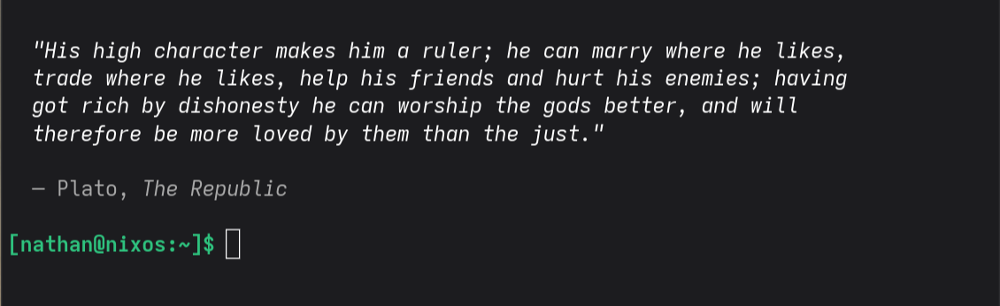

# readwise-terminal-quotes

A random Readwise highlight on every terminal open.



## Features

- Random highlight from your full Readwise library on shell startup
- `Ctrl+L` clears and fetches a new quote
- Instant display — quotes pre-fetched in background, no startup latency
- Clickable `↗` link opens the highlight on readwise.io
- Shows tags, author, and book title
- Offline fallback to cached quotes

## Setup

1. Get your token at [readwise.io/access_token](https://readwise.io/access_token)
2. Add to your shell config:
```sh
export READWISE_TOKEN="your_token"
python3 /path/to/quote.py
```
3. Bind `Ctrl+L` (optional):
```zsh
_readwise_clear() { clear; python3 /path/to/quote.py; zle reset-prompt }
zle -N _readwise_clear
bindkey '^L' _readwise_clear
```
